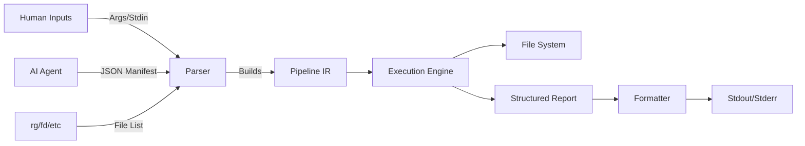

# Project Blueprint: `sd2` (Structured Displacer)

`sd2` is a text-processing tool built around a single idea:

* **Humans** want a fast CLI that composes well in pipelines
* **AI agents** want a typed plan, deterministic execution, and machine-readable reports

`sd2` is **not** a `sed` clone. Compatibility is irrelevant.

## Goals

* **One canonical plan format**: a typed IR called `Pipeline`
* **Dual-mode UX**: “quick CLI” and “manifest apply” compile into the same IR
* **Deterministic execution**: stable ordering, stable output, stable IDs
* **Observability**: reports with diffs, counts, errors, and per-file status
* **Safe writes**: transactional application (in-memory transform, then write)

---

## 1. Architecture

`sd2` follows a **compiler pattern**:

1. **Ingest**: CLI args, JSON manifest, and/or stdin file list
2. **Normalize**: compile inputs into a single typed `Pipeline` IR
3. **Execute**: apply the pipeline with a transactional engine
4. **Report**: produce human-friendly text or machine JSON



---

## 2. Directory Structure

```text
sd2/
├── Cargo.toml
└── src/
    ├── main.rs       # CLI entry, stdin ingestion, wiring, exit codes
    ├── model.rs      # Data contract: IR + JSON Schema
    ├── engine.rs     # Execution: read/transform/write + diff generation
    └── reporter.rs   # Human/JSON output, summaries, structured errors
```

Suggested crates:

* `clap` (CLI)
* `serde`, `serde_json` (manifest + report)
* `schemars` (schema generation)
* `similar` (diffs)
* `ignore` (gitignore-aware walking if you ever add “scan” mode)
* `atty` or `is-terminal` (TTY detection)

---

## 3. The Data Contract

The contract is the product. Everything compiles into this.

### `src/model.rs`

Key design choices for agent-friendliness:

* **Operation IDs** so reports can reference exactly what ran
* **Stable ordering**: files are processed in a deterministic order
* **Structured errors** with codes and locations
* **Explicit encoding assumptions** (UTF-8 vs bytes mode)

```rust
use schemars::JsonSchema;
use serde::{Deserialize, Serialize};

#[derive(Debug, Clone, Serialize, Deserialize, JsonSchema)]
#[serde(rename_all = "snake_case")]
pub enum Operation {
    Replace {
        id: String,

        find: String,
        with: String,

        #[serde(default)]
        limit: Option<usize>, // None = replace all

        #[serde(default)]
        literal: bool, // true = literal find, false = pattern (future)
    },
    // Future: RegexReplace, Delete, Insert, Surround, PatchHunks, etc
}

#[derive(Debug, Clone, Serialize, Deserialize, JsonSchema)]
pub struct Pipeline {
    pub files: Vec<String>,
    pub operations: Vec<Operation>,

    #[serde(default)]
    pub dry_run: bool,

    #[serde(default)]
    pub fail_fast: bool, // stop on first error

    #[serde(default)]
    pub stable_sort: bool, // sort file list for deterministic execution
}

#[derive(Debug, Clone, Serialize, Deserialize, JsonSchema)]
#[serde(rename_all = "snake_case")]
pub struct Report {
    pub status: Status,
    pub summary: Summary,
    pub files: Vec<FileReport>,
    pub errors: Vec<Sd2Error>,
}

#[derive(Debug, Clone, Serialize, Deserialize, JsonSchema)]
#[serde(rename_all = "snake_case")]
pub enum Status {
    Success,
    PartialSuccess,
    Failed,
}

#[derive(Debug, Clone, Serialize, Deserialize, JsonSchema)]
pub struct Summary {
    pub files_total: usize,
    pub files_changed: usize,
    pub ops_total: usize,
    pub duration_ms: u128,
}

#[derive(Debug, Clone, Serialize, Deserialize, JsonSchema)]
pub struct FileReport {
    pub path: String,
    pub changed: bool,

    #[serde(default)]
    pub bytes_before: usize,
    #[serde(default)]
    pub bytes_after: usize,

    #[serde(default)]
    pub diff: Option<String>, // unified diff for dry-run / verbose modes

    pub operations_applied: Vec<String>, // operation IDs
}

#[derive(Debug, Clone, Serialize, Deserialize, JsonSchema)]
pub struct Sd2Error {
    pub code: String,              // e.g. "E_IO", "E_UTF8", "E_OP_INVALID"
    pub message: String,
    #[serde(default)]
    pub path: Option<String>,
    #[serde(default)]
    pub operation_id: Option<String>,
}
```

---

## 4. Interfaces

### A. Human CLI (quick mode)

Humans should be able to do the obvious thing with minimal ceremony:

```bash
fd '\.rs$' | sd2 replace --find old_name --with new_name --dry-run
```

**Rules:**

* If `files` are not provided, read newline-delimited paths from stdin (pipes)
* If stdin is TTY and no files were provided, error with a helpful message
* CLI args compile to the same `Pipeline` IR as a manifest

### B. Agent CLI (manifest mode)

```bash
sd2 apply --manifest refactor_plan.json --json
```

Manifest stays simple and explicit:

```json
{
  "files": ["src/lib.rs", "src/api.rs"],
  "operations": [
    {
      "replace": {
        "id": "op_process_sig",
        "find": "fn process(data: String)",
        "with": "fn process(data: &str)",
        "limit": null,
        "literal": true
      }
    }
  ],
  "dry_run": false,
  "fail_fast": true,
  "stable_sort": true
}
```

### C. Schema mode

Agents need the tool to self-describe:

```bash
sd2 schema
```

Output: JSON Schema for `Pipeline` (and optionally `Report`), so an agent can generate correct manifests without guessing.

---

## 5. Execution Engine

### `src/engine.rs`

Engine responsibilities:

* Read file content (UTF-8 by default)
* Apply operations in order
* Track whether each operation actually changed anything
* Produce diffs for dry-run or verbose mode
* Write back only if successful and not dry-run

Recommended behavior:

* Deterministic processing order (`stable_sort` on by default for manifests)
* No partial writes for a file: transform in memory, then write once
* Clear error codes for common failure modes (permission, missing file, non-UTF8, etc)

---

## 6. Reporter

### `src/reporter.rs`

Two output families:

**TTY (human)**

* concise per-file summary
* optional diffs on `--dry-run` / `--verbose`
* clear final status line
* non-zero exit code on `Failed` or `PartialSuccess` (configurable)

**JSON (agent)**

* print a single JSON object: the `Report`
* no extra chatter on stdout
* send human hints to stderr if needed

---

## 7. Roadmap

### Phase 1: Skeleton

* `clap` commands: `replace`, `apply`, `schema`
* `model.rs` with `schemars`
* `sd2 schema` outputs schema

### Phase 2: Core transform

* literal string replace
* stdin file list ingestion
* deterministic ordering

### Phase 3: Observability

* `Report` + JSON output
* `similar` unified diff for dry-run

### Phase 4: Power ops

* regex replace (explicit engine choice)
* insert/delete/surround
* selection modes (line ranges, anchors, simple match predicates)
